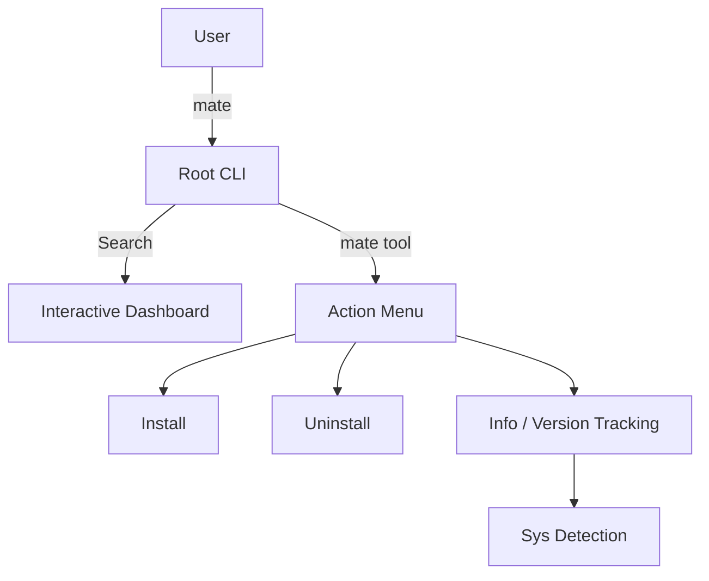

# 📦 Package Mate — The Ultimate macOS Dev Environment Manager

[](https://golang.org)
[](https://opensource.org/licenses/MIT)
[](https://www.apple.com/macos)

`package-mate` (or simply `mate`) is an ultra-lean, tool-centric CLI designed to manage your macOS development environment with surgical precision. It's not just another package manager wrapper; it's your intelligent companion for keeping your dev tools clean, organized, and up-to-date.

---

## ✨ Features

- **🚀 Instant Search Dashboard**: Just run `mate` to see everything available.
- **🛡️ Smart Detection**: Automatically detects if tools are installed via Homebrew, manually, or as unmanaged binaries.
- **📅 Historical Context**: Tracking exactly when you installed your components.
- **🛠️ Interactive Menu**: One-click actions for `Install`, `Uninstall`, and `Info`.
- **💎 Premium UI**: Beautifully crafted terminal interface with vibrant colors and clear typography.

---

## 🏗️ Architecture



---

## 🛠️ Installation

```bash
# Clone the repository
git clone https://github.com/yousefbustamiii/package-mate.git
cd package-mate

# Build and install locally
go build -o mate main.go
sudo mv mate /usr/local/bin/mate
```

---

## 🚀 Usage

### Launch Dashboard
Simply run `mate` to enter the interactive tool selector.
```bash
mate
```

### Direct Tool Access
Jump straight to a specific tool's management menu.
```bash
mate node
mate docker
mate postgres
```

> [!TIP]
> Package Mate works best when you let it manage your entire toolkit. It will alert you if it finds "unmanaged" versions conflicting with its managed catalog.

---

## 📂 Project Structure

- `cmd/`: Command implementations (`info`, `install`, `uninstall`).
- `internal/components/`: The software catalog and resolution logic.
- `internal/installer/`: Heavy lifting for Homebrew and system interaction.
- `internal/ui/`: The secret sauce behind the beautiful terminal interface.

---

## 🤝 Contributing

1. Fork it!
2. Create your feature branch (`git checkout -b feature/amazing-feature`)
3. Commit your changes (`git commit -m 'Add some amazing feature'`)
4. Push to the branch (`git push origin feature/amazing-feature`)
5. Create a new Pull Request

---

## 📄 License

Distributed under the MIT License. See `LICENSE` for more information.

---

<p align="center">
  Crafted with ❤️ for the macOS developer community.
</p>
